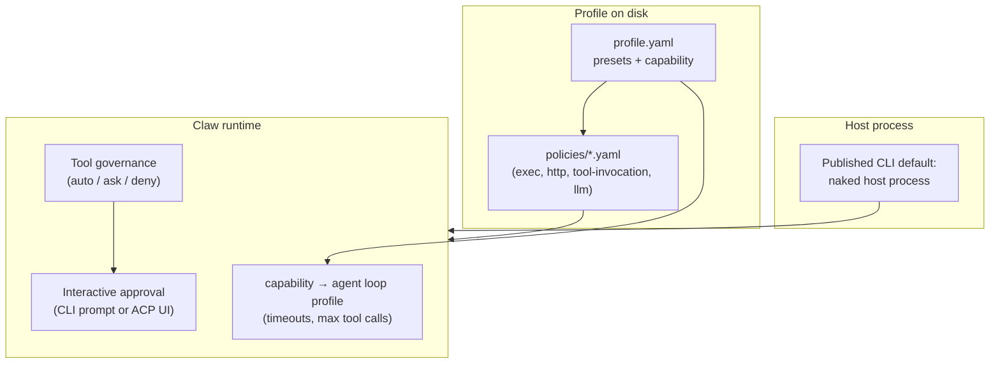

# Security: policies, presets, identity, and capability

**Chinese:** [security-and-policies.zh.md](security-and-policies.zh.md)

This page describes **how to configure** what the agent is allowed to do: OS command execution (exec), outbound HTTP allowlists, per-tool invocation rules, LLM defaults, persona (identity), and the **capability** (agent loop mode). Apply changes with `finclaw policy …` and `finclaw profile apply` as described below.

**Authoritative for flags:** `finclaw policy --help`, `finclaw identity --help`, `finclaw capability --help`.

## Multi-dimensional security control model

Security in `finclaw` is **not** a single switch. Several **independent** mechanisms stack together. Tightening one layer does not automatically fix another—review each dimension for your threat model.



| Dimension | What it controls | Typical user touchpoints |
| --- | --- | --- |
| **A. Host process posture** | Published binaries run the agent as a **normal local process** (“naked” host). There is **no** global `--security` switch on current releases — confirm with `finclaw --help` | OS account permissions; optional external sandboxes you wrap yourself |
| **B. Exec policy** | Whether `exec` exists at all, program allow/deny lists, sandbox flags, network for subprocesses | `presets.exec`, `policies/exec-policy.yaml`, `finclaw policy apply exec` |
| **C. HTTP allowlist** | Outbound domains for fetch/browser-style tools; browser SSRF posture | `presets.http`, `policies/http-allowlist.yaml` |
| **D. Tool invocation policy** | Autonomy **mode** (`readonly` / `supervised` / `full`) and per-tool **auto-approve**, **always-ask**, **deny** sets | `presets.tool`, `policies/tool-invocation-policy.yaml` |
| **E. Capability (agent loop profile)** | Wall-clock **timeout**, **max tool calls**, research sub-budgets, continuation—selected by **capability string** (`general`, `coding`, `read_only`, …) | `finclaw capability set`, `finclaw chat --capability …`, `finclaw acp --capability …` |
| **F. Identity / persona** | What the model is told about itself (system prompt surface) | `finclaw identity …`, `finclaw agent edit …` for Markdown layers |
| **G. Interactive approval (supervised tools)** | When policy requires it, the runtime **pauses** until a human approves: line-based CLI can prompt; **ACP** uses the editor permission UI; full-screen `--tui` may auto-reject with a warning | See *Interactive tool approvals* below |

**How dimensions interact (short):**

- **Naked host (A)** does **not** replace policy files (B–D). Even without an OS sandbox, `ask_for_writes` and deny lists still matter.
- **Tool preset `ask_for_writes`** (D) sets **supervised** mode and puts destructive tools (`write_file`, `apply_patch`, `exec`, …) in **always ask**, while read/search/skill-discovery tools can stay on an **auto-approve** allowlist until you edit YAML.
- **Tool preset `auto_all`** (D) maps to **full** autonomy in the shipped preset—suited only when you already trust the environment and downstream policies.
- **Capability `read_only`** (E) (often used together with **research-style** profiles) selects a **tighter agent-loop profile** in the runtime (for example shorter wall-clock timeouts, lower default `max_tool_calls`, continuation often off)—this is **about loop budget**, not by itself blocking tools; combine with (D) and **allowed_tools** tweaks on templates if you need hard blocks.
- **Capability `coding`** (E) selects the **coding** loop profile—typically **higher** iteration/tool budgets and longer per-tool timeouts intended for repo work—not a substitute for reviewing (B)(C)(D).

### Built-in profile templates vs policy (orientation)

Official **templates** (see [profiles.md](profiles.md)) combine presets; they illustrate how product defaults line up—they are **not** a substitute for reading your resolved YAML.

| Template (concept) | Typical `capability` | Typical tool preset | Typical exec preset | Typical HTTP preset | Notes |
| --- | --- | --- | --- | --- | --- |
| General-purpose | `general` | `ask_for_writes` | `read_only_safe` | `lan_only` | Conservative defaults for everyday chat |
| Researcher / read-heavy | **`read_only`** | `ask_for_writes` | `read_only_safe` | **`open_internet`** | Same **tool-invocation** preset expansion as general in many setups; differs by capability, HTTP, and often **explicit tool exclusions** (`!exec`, …) on the template |
| Coder | `coding` | **`auto_all`** | **`local_power_user`** | `open_internet` | Highest automation preset in the catalogue; strongest **trust boundary** assumptions—use with care |

Always confirm with **`finclaw profile show --resolved`** and **`finclaw policy show <kind> --resolved`** on your machine.

### Tool preset internals (orientation)

Exact tool names evolve with each Claw release. The following **intent** is stable:

| `presets.tool` | Runtime autonomy mode (typical) | User-visible effect |
| --- | --- | --- |
| `ask_for_writes` | **supervised** | Explicit **always-ask** list for mutating tools (`edit_file`, `write_file`, `apply_patch`, `exec`, …); read/search/fetch/skills-discovery tools commonly on **auto-approve** until you customize YAML |
| `auto_all` | **full** | No policy-driven supervised list from the preset—**all tools** gated only by capability, exec/http policy, host sandbox, and model behavior |
| `deny_all` | **readonly** | Very restrictive posture; see resolved YAML |

### Interactive tool approvals (supervised flows)

When the runtime requires confirmation for a tool call (**always-ask** entry or supervised **Act-class** tools not auto-approved):

1. The streaming inference session may emit an **`approval_required`** event over SSE.
2. Some client must **`POST`** to **`/ai/infer/approval/resolve`** with `approval_request_id` and **`approved`** true/false. In **automation**, protect this path (for example with `INTERNAL_APPROVAL_RESOLVE_TOKEN` on the runtime and matching bearer on callers).
3. The **classic** line-based **`finclaw chat`** prompts **y/n** before sending that approve/reject decision when stdin is interactive.
4. The **fullscreen** **`--tui`** REPL currently **cannot reliably prompt** in all terminal states; builds may **auto-reject** pending approvals **with a runtime warning**. For approval-heavy supervised workflows, prefer **interactive line-based `chat`** (without `--tui`) or reduce reliance on **`auto_all`** until your client build supports reliable prompts in the T UI.

If nothing calls **resolve**, the request may stall until **live approval** times out server-side—a failure mode operators should recognise.

### Per-session CLI hints (`finclaw chat`)

Independent of on-disk policy, you can pass **one-shot** hints that bias how the runtime treats **guarded** tools for a single `chat` invocation: `--auto-approve-all-tools` (force auto-approve) and `--confirm-all-tools` (force confirmation). They are mutually exclusive. Prefer durable policy in `policies/*.yaml` for anything that must survive past one command; use CLI hints for automation sandboxes you already trust. See `finclaw chat --help`.

### Operational checklist

- [ ] **Host posture**: Treat the published CLI as a **naked** process; tighten **policy** + **supervised** tools on untrusted work.
- [ ] **Profiles**: Preserve `profile.yaml` + `policies/` in backups; audit **presets** after upgrades.
- [ ] **`finclaw capability`**: Matches product intent (`general` vs `coding` vs `read_only`).
- [ ] **`finclaw policy show … --resolved`**: Inspect **effective** YAML before sharing a profile externally.
- [ ] **`finclaw doctor`**: Resolve drift (`file` vs `live`).
- [ ] **Supervised approval**: Operators using resolve endpoints automate only with bearer tokens scoped to infra.

## Host execution posture (published CLI)

Published `finclaw` binaries from this repository run as a **normal user process** by default (“naked” host). Current releases **do not** ship a global `--security` flag — always verify with `finclaw --help` on your install.

What still protects you:

- **On-disk policies** under `<profile_root>/policies/` (exec allowlists, HTTP allowlists, tool auto/ask/deny)
- **Supervised approvals** in the CLI or ACP client (Zed permission UI)
- **Capability / loop budgets** (`finclaw capability`, `--capability`)
- Your **OS account** permissions and any outer sandbox *you* wrap around the binary

If an older guide mentions `finclaw --security …`, treat it as outdated for current Releases unless `finclaw --help` lists that flag again.

## Policy kinds (on disk)

Under `<profile_root>/policies/`, four policy **kinds** are used (file names are conventional):

| Kind | File name (typical) | What it controls |
| --- | --- | --- |
| tool-invocation | `tool-invocation-policy.yaml` | Auto-approve vs ask vs deny per tool |
| exec | `exec-policy.yaml` | Whether exec is enabled, allowlist/blocklist, sandbox, network |
| http-allowlist | `http-allowlist.yaml` | Allowed outbound domains and browser SSRF posture |
| llm-defaults | `llm-defaults.yaml` | Default temperature, max tokens, thinking flags |

You can also point to explicit paths from `profile.yaml` under a `policies:` key; your `finclaw profile show --resolved` output reflects the resolved layout.

## Choosing presets in `profile.yaml`

Instead of hand-writing all YAML, set **presets** (snake_case) under `presets:`:

```yaml
presets:
  exec: local_power_user
  http: api_curated
  tool: ask_for_writes
```

**There is no dedicated `finclaw preset set` command** — edit `profile.yaml` with `finclaw profile edit` or an editor, then run `finclaw profile apply`.

### Resolution order (simplified)

For each policy **kind**, the effective body is typically resolved as:

1. Explicit file path in `profile.yaml` for that kind (if set), or
2. The file `<profile_root>/policies/<kind>.yaml` if it exists, or
3. The **preset** from `profile.yaml` for that kind (expanded at apply time), or
4. **Skip** (no override file and no preset) — the runtime’s baseline continues to apply.

A hand-edited `policies/*.yaml` **wins** over a preset for that kind. Presets are often materialised to disk **only when** the policy file is missing; behaviour is summarized when you run `finclaw policy show <kind> --resolved`.

## Preset catalogues (v1, typical)

Values below are **policy intent**; always confirm with `finclaw policy show exec --resolved` on your build.

### Exec presets (`presets.exec`)

| Name | Summary |
| --- | --- |
| `read_only_safe` | Exec effectively off; blocklist `*`; no network/process as exposed by policy |
| `workspace_dev` | Exec on; allowlist includes common dev tools (**includes `curl`**, not `ls`); sandbox on; network on |
| `local_power_user` | Exec on; wider allowlist including **`ls`**, `cat`, `git`, `curl`, `make`, `just`, language runtimes, etc.; sandbox on; network and process as per policy |
| `full_admin` | Most permissive exec preset; **strong warnings** at apply time — use only when you understand the risk |

### HTTP presets (`presets.http`)

| Name | Summary |
| --- | --- |
| `lan_only` | Local/private address patterns; strict browser SSRF policy |
| `api_curated` | Small set of common API / Git / vendor hosts; strict browser SSRF policy |
| `open_internet` | Broad outbound allow; **strong warnings** at apply time |

### Tool presets (`presets.tool`)

| Name | Summary |
| --- | --- |
| `auto_all` | High automation for tool use |
| `ask_for_writes` | More confirmation on writes, edits, exec, browser tools |
| `deny_all` | Deny-style posture for tools (see resolved YAML) |

`llm-defaults` may not use the same `presets.*` short form on all versions — if absent, set `policies/llm-defaults.yaml` or use `finclaw policy edit llm-defaults`.

## `finclaw policy` commands

```bash
# On-disk (or resolved from preset) vs live runtime
finclaw policy show exec --source file
finclaw policy show exec --resolved
finclaw policy show exec --source live

# Edit YAML in $EDITOR (scaffold from preset when the file is missing)
finclaw policy edit exec

# Push policies to the running runtime (or embedded path per build)
finclaw policy apply exec
finclaw policy apply

# Compare file vs live
finclaw policy diff exec
finclaw policy diff --check

# Remove on-disk file so preset/baseline can apply on next apply
finclaw policy reset exec
```

`policy show` and `policy edit` use policy kind names such as: `tool-invocation`, `exec`, `http-allowlist`, `llm-defaults` (see `--help`).

**Note:** A `policy set key=value` style subcommand is **not** a substitute for editing YAML in many builds. Prefer `finclaw policy edit <kind>` and `finclaw policy apply <kind>`.

## `identity` and `capability`

- **Identity** — `IDENTITY.md` and rendering to the runtime AIEOS file: `finclaw identity` (`show`, `edit`, `render`, `reset`). Multiple sources can exist; **precedence** is complex—after edits, run `finclaw identity render` and `finclaw profile apply` if chat does not reflect changes.
- **Capability** — which agent **loop** profile is used: `finclaw capability set`, `finclaw capability show`, `finclaw capability list`. A one-shot chat can pass `--capability` without changing the file.

## REPL

Inside `finclaw chat`, use `/policy`, `/identity`, and `/capability` for session-oriented shortcuts; `/policy reload` re-applies from disk in supported builds. Type `/help` in the REPL for the list on your version.

## Doctor and drift

```bash
finclaw doctor
finclaw doctor --fix
```

`doctor` can report policy drift (on-disk file vs what the runtime holds). If drift appears after out-of-band changes, re-run `finclaw policy apply` or align files with `finclaw policy show <kind> --source live`.

## See also

- [configuration.md](configuration.md) — `config.yaml`, env, and global flags (`--finclaw-home`, `--config`, `--locale`)
- [acp.md](acp.md) — IDE / ACP approvals
- [profiles.md](profiles.md) — `profile apply`, backup/import
