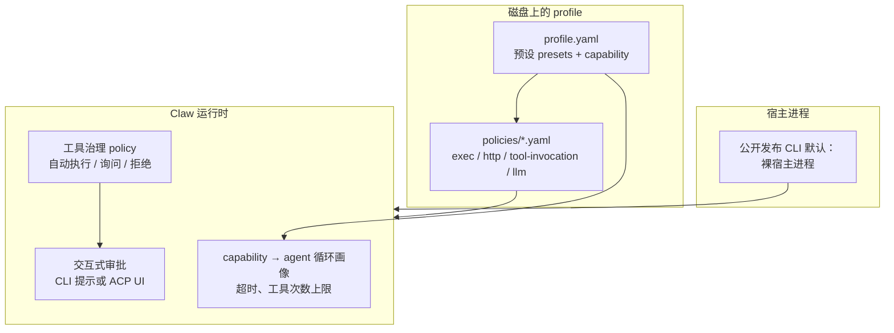

# 安全：策略、预设、身份与能力

**English:** [security-and-policies.md](security-and-policies.md)

本文说明如何配置智能体的**允许范围**：操作系统命令执行（exec）、出站 HTTP 白名单、按工具的调用策略、LLM 默认值、**人设**（identity）以及**能力**（capability，对应不同 agent 循环/模式）。与 `finclaw policy …`、`finclaw profile apply` 配合使用。

**子命令以本机 `finclaw policy --help`、`finclaw identity --help`、`finclaw capability --help` 为准。**

## 多维安全控制模型（总览）

`finclaw` / Claw 的安全策略不是**单一开关**，而是多层机制**叠加**；收紧一层**不会自动**修好另一层的漏洞——请按自身的威胁模型逐层检视。

以下各维相对独立，但共同决定在用户机器上与模型侧的“可观测行为”边界。



| 维度 | 控制什么 | 用户常见入口 |
| --- | --- | --- |
| **A. 宿主进程姿态** | 公开发布的二进制以**普通本机进程**运行（“裸宿主”）。当前版本**没有**全局 `--security` 开关 — 请用 `finclaw --help` 核对 | OS 账号权限；你自行外层包装的沙箱 |
| **B. Exec 策略** | `exec` 是否可用、命令白/黑名单、子进程沙箱与网络策略等 | `presets.exec`、`policies/exec-policy.yaml`、`finclaw policy apply exec` |
| **C. HTTP 白名单** | 出站域名（含浏览器类工具可走的主机范围）、浏览器 SSRF 姿态 | `presets.http`、`policies/http-allowlist.yaml` |
| **D. 工具调用策略** | **自主度模式**（`readonly` / `supervised` / `full`）以及按工具的 **auto-approve / always-ask / deny** 集合 | `presets.tool`、`policies/tool-invocation-policy.yaml` |
| **E. Capability（agent 循环画像）** | 单次请求的**墙钟超时**、**最大工具调用次数**、研究与续跑等相关预算——由 **capability 字符串**选择（如 `general`、`coding`、`read_only`） | `finclaw capability set`、`finclaw chat --capability …`、`finclaw acp --capability …` |
| **F. Identity / 人设** | 系统提示中如何描述智能体与用户责任边界（认知层） | `finclaw identity …`，Markdown 各层可用 `finclaw agent edit …` |
| **G. 交互式审批（supervised）** | 策略要求确认时，运行时**暂停**直至有人批准：行式 CLI 可提示；**ACP** 走编辑器权限 UI；全屏 `--tui` 可能自动拒绝并告警 | 详见下文 **交互式审批** |

**维度之间如何分工（简述）：**

- **裸宿主（A）不能替代**磁盘策略（B–D）。即使没有 OS 沙箱，`ask_for_writes` 与 deny 列表仍然重要。
- **工具预设 `ask_for_writes`**（D）对应运行时的 **supervised** 语义，并把**破坏性工具**放入 **always ask**（如 `edit_file`、`write_file`、`apply_patch`、`exec`）；读目录/检索/抓取/技能发现等常见于 **auto_approve**，直至你手写 YAML 覆盖。
- **`auto_all`**（D）在出厂预设上等价 **full**：更偏“自动化”，只适合**已信任**的环境与下层策略均已审查的场景。
- **`read_only` capability**（E）（常与**研究类**模版一起使用）会选择更**紧缩**的 **agent 循环默认值**（如更短的墙钟超时、默认更少的工具次数、often 关闭续跑等）；这是**会话预算与形态**，**单靠它不会** magically 禁止写入——若需要硬否决，要结合（D）、允许工具列表、`deny` 等。
- **`coding` capability**（E）选择 **coding** 循环画像：通常**更高**的迭代与工具配额、单次工具超时等，面向仓库级开发；**不等于**可以跳过对（B）（C）（D）的检视。

### 出厂模版与策略的组合（对齐预期）

模版仅把若干 preset **组合展示**给用户；**请以本机解析结果为准**。详见 [profiles.zh.md](profiles.zh.md)。

| 模版含义 | 典型 capability | 典型 tool 预设 | 典型 exec | 典型 HTTP | 备注 |
| --- | --- | --- | --- | --- | --- |
| 通用助手 | `general` | `ask_for_writes` | `read_only_safe` | `lan_only` | 日常使用偏保守默认 |
| 研究 / 偏只读浏览 | **`read_only`** | 常与通用场景同为 **`ask_for_writes`** | `read_only_safe` | **`open_internet`** | 与同 tool 预设的「通用」相比，差异主要在 **capability、HTTP**，以及模版上常见的 **`!exec` / `!shell`** 等显式剔除 |
| 编程 | `coding` | **`auto_all`** | **`local_power_user`** | `open_internet` | 自动化程度在产品目录中偏高；信任边界要强 |

务必用 **`finclaw profile show --resolved`** 与 **`finclaw policy show <kind> --resolved`** 核对**有效** YAML。

### 工具预设内在语义（方向性说明）

具体工具名单会随 **Claw 版本**演进；下表刻画**语义**相对稳定：

| `presets.tool` | 典型自主度 mode | 对用户的含义 |
| --- | --- | --- |
| `ask_for_writes` | **supervised** | **`always_ask`** 显式点名大量“会改磁盘/执行”的工具；读写类检索、联网抓取、技能只读往往在 **auto_approve**，直至你改写 YAML |
| `auto_all` | **full** | 预设体本身不再列一堆 supervised——仍受 exec/http、宿主沙箱、模型与策略其它部分约束 |
| `deny_all` | **readonly** | 极紧策略；请以解析 YAML 为准 |

### 交互式审批（supervised）

当某次调用落在 **always-ask**，或在 supervised 模式下对 **Act 类**危险工具且未列入 auto_approve：

1. 流式推理会话可能下发 **`approval_required`** 类 SSE 事件。
2. 某客户端必须对 **`POST /ai/infer/approval/resolve`** 提交 **`approval_request_id`** 以及 **`approved` true/false**。自动化场景应对该路径施加鉴权（例如运行环境中的 **`INTERNAL_APPROVAL_RESOLVE_TOKEN`** 与 Bearer 一致）。
3. **经典行式 `finclaw chat`**：在 stdin 为交互 TTY 时，可能先 **询问 Y/N** 再替你提交批复。
4. **全屏 `--tui` REPL**：在部分环境下**无法稳妥做行追问**，构建可能对挂起审批 **自动拒绝** 并以 **`warn`** 级别提示。若你希望**每次敏感操作都有人眼确认**，在对应 UX 就绪前更应使用**行式交互 `chat`** 或减少 `auto_all` 依赖。

若无人调用 **resolve**，会话可能卡住直至服务端 **实时审批超时**——运维场景需知晓。

### 单次 CLI 提示（`finclaw chat`）

与磁盘上的策略独立，仍可在**单次** `chat` 调用上附加对 guarded 工具的倾向：`--auto-approve-all-tools`（倾向全自动）与 `--confirm-all-tools`（倾向全部确认），二者互斥。需要长期生效的约束请写在 `policies/*.yaml`；CLI 提示适合已充分信任的临时自动化环境。详见 `finclaw chat --help`。

### 运维自检清单（可打印）

- [ ] **宿主姿态**：把公开发布的 CLI 当作**裸进程**；在不信任的工作上收紧**策略**与 **supervised** 工具。
- [ ] **Profile**：备份 **`profile.yaml` + `policies/`**；大版本升级后复查 **presets**。
- [ ] **`finclaw capability`**：与产品与合规预期一致。
- [ ] **`finclaw policy show … --resolved`**：对外分享的 profile **先过目**解析结果。
- [ ] **`finclaw doctor`**：消解 **file vs live** 漂移。
- [ ] **审批自动化**：仅用受控 Bearer，勿把令牌写进不可信会话日志。

## 宿主执行姿态（公开发布 CLI）

本仓库发布的 `finclaw` 二进制默认以**普通用户进程**运行（“裸宿主”）。当前版本**不提供**全局 `--security` 参数 — 请始终用本机 `finclaw --help` 核对。

仍然起作用的保护：

- **磁盘策略** `<profile_root>/policies/`（exec 白名单、HTTP 白名单、工具 auto/ask/deny）
- **受监督审批**（CLI 提示或 ACP 客户端 / Zed 权限 UI）
- **Capability / 循环预算**（`finclaw capability`、`--capability`）
- 你的 **OS 账号**权限，以及你在二进制外层自行包装的沙箱

若旧文档仍写 `finclaw --security …`，对当前 Releases 视为过时，除非 `finclaw --help` 再次列出该参数。

## 策略类型（磁盘上的 kind）

在 `<profile_root>/policies/` 下，常见文件命名习惯如下：

| 类型 | 典型文件名 | 作用 |
| --- | --- | --- |
| tool-invocation | `tool-invocation-policy.yaml` | 各工具自动执行 / 询问 / 拒绝 |
| exec | `exec-policy.yaml` | 是否允许 exec、白名单/黑名单、沙箱、网络等 |
| http-allowlist | `http-allowlist.yaml` | 出站域名与浏览器 SSRF 相关策略 |
| llm-defaults | `llm-defaults.yaml` | 温度、max tokens、思考开关等默认 |

`profile.yaml` 里 `policies:` 下也可为各 kind 指定**显式路径**；以 `finclaw profile show --resolved` 的解析结果为准。

## 在 `profile.yaml` 中选择预设（presets）

不必手写全部 YAML 时，可在 `presets:` 中使用 **snake_case** 名称：

```yaml
presets:
  exec: local_power_user
  http: api_curated
  tool: ask_for_writes
```

**没有**单独的 `finclaw preset set` 子命令 — 需编辑 `profile.yaml`（`finclaw profile edit` 或任意编辑器）后执行 `finclaw profile apply`。

### 解析顺序（简版）

每个策略 **kind** 的大致有效来源为：

1. `profile.yaml` 中为该 kind 配置的**显式文件路径**（若存在），或
2. 若存在则加载 `<profile_root>/policies/<对应文件>.yaml`，或
3. `profile.yaml` 中 `presets` 的展开结果（在 apply 时生效），或
4. 以上皆无则 **不覆盖**（skip），沿用运行时**内置基线**。

手写的 `policies/*.yaml` 对该 kind 通常**优先于**同名预设。`finclaw policy show <kind> --resolved` 可看到展开后的内容。

## 预设目录（v1 典型，以本机 `policy show --resolved` 为准）

### Exec（`presets.exec`）

| 名称 | 概要 |
| --- | --- |
| `read_only_safe` | 基本关闭类 exec 能力，黑名单覆盖等 |
| `workspace_dev` | 开启 exec，白名单为常见开发工具（**含 `curl`、不含 `ls`** 等，以解析结果为准） |
| `local_power_user` | 更宽白名单，含 **`ls`、 `curl`**、语言工具链等；仍多要求沙箱 |
| `full_admin` | 非常宽松，**应用时常有强警告** |

### HTTP（`presets.http`）

| 名称 | 概要 |
| --- | --- |
| `lan_only` | 偏向局域网/本机类地址；浏览器 SSRF 策略偏严格 |
| `api_curated` | 常见 API/Git/厂商域名的小集合；偏严格 |
| `open_internet` | 广域出站；**应用时常有强警告** |

### 工具（`presets.tool`）

| 名称 | 概要 |
| --- | --- |
| `auto_all` | 自动化程度较高 |
| `ask_for_writes` | 写类、执行类、浏览器工具等更偏确认 |
| `deny_all` | 更偏“拒绝/收紧”的 posture（以解析 YAML 为准） |

`llm-defaults` 未必在所有版本都通过同名 `presets` 简写；缺失时可写 `policies/llm-defaults.yaml` 或使用 `finclaw policy edit llm-defaults`。

## `finclaw policy` 子命令

```bash
finclaw policy show exec --source file
finclaw policy show exec --resolved
finclaw policy show exec --source live
finclaw policy edit exec
finclaw policy apply exec
finclaw policy apply
finclaw policy diff exec
finclaw policy diff --check
finclaw policy reset exec
```

**说明：** 许多版本**没有** `finclaw policy set key=value` 这类子命令，请以 `finclaw policy --help` 为准；更稳妥的方式是 `policy edit` 后 `policy apply`。

## identity 与 capability

- **Identity** — `finclaw identity`：`show` / `edit` / `render` / `reset`。若改文件后聊天未变，可执行 `identity render` 再 `profile apply`。
- **Capability** — `finclaw capability set` / `show` / `list`；单次对话可用 `finclaw chat --capability <name> -m "..."` 而不改 `profile.yaml`。

## REPL

在 `finclaw chat` 内可用 `/policy`、`/identity`、`/capability` 等；部分构建支持 `/policy reload`。以 REPL 内 `/help` 为准。

## doctor 与漂移

```bash
finclaw doctor
finclaw doctor --fix
```

出现策略漂移时，可重新 `finclaw policy apply`，或对照 `finclaw policy show <kind> --source live` 调整磁盘文件。

## 另见

- [configuration.zh.md](configuration.zh.md) — `config.yaml`、环境变量、全局参数（`--finclaw-home`、`--config`、`--locale`）
- [acp.zh.md](acp.zh.md) — IDE / ACP 审批
- [profiles.zh.md](profiles.zh.md) — `profile apply`、备份/导入
- [profiles.zh.md](profiles.zh.md) — `profile apply`、备份与导入
